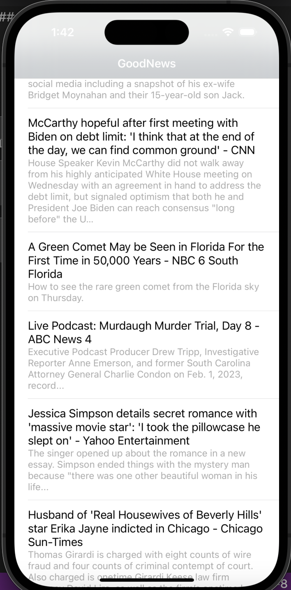

# News Head Line Project

## 학습 사항
- MVVM Design Pattern

## 유의 사항
- NewsHeadLine/API_KEY 파일을 추가하고 [NEWS API SITE](https://newsapi.org/)에서 발급받은 API_KEY를 JSON형태로 추가하기.

## 스크린샷

## 출처
- [Udemy MVVM Lecture](https://www.udemy.com/course/mastering-mvvm-for-ios/)
